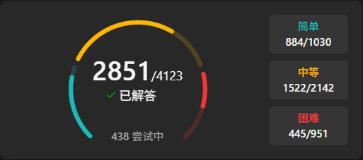

# LeetCode 刷题记录 / LeetCode Solutions

[中文](#中文) | [English](#english)

---


### 📝 项目简介

本仓库用于记录个人在 LeetCode 平台的刷题历程，包含各类算法题目的解题代码、思路分析和学习笔记。

### 📊 刷题进度


最近一次更新：2025.11.03

### 📂 目录结构
```
├── Easy/          # 简单难度题目
├── Medium/        # 中等难度题目
├── Hard/          # 困难难度题目
```

### 💡 解题语言

- Python3 (优先)
- C
- C++
- JavaScript
- (可根据实际情况调整)


### 🔗 相关链接

- [LeetCode 中国站](https://leetcode.cn/)
- [LeetCode 国际站](https://leetcode.com/)

### ⭐ 如果这个仓库对你有帮助，欢迎 Star！

---

## English

### 📝 About

This repository contains my solutions to LeetCode problems, including code implementations, problem-solving approaches, and learning notes.

### 📊 Progress

Last updated: 2025.11.03


### 📂 Repository Structure
```
├── Easy/          # Easy difficulty problems
├── Medium/        # Medium difficulty problems
├── Hard/          # Hard difficulty problems
```

### 💡 Programming Languages

- Python (Primary)
- C
- C++
- JavaScript
- (Adjust based on your preference)


### 🔗 Useful Links

- [LeetCode](https://leetcode.com/)
- [LeetCode CN](https://leetcode.cn/)

### ⭐ If you find this repository helpful, please consider giving it a star!

---

## License

MIT License